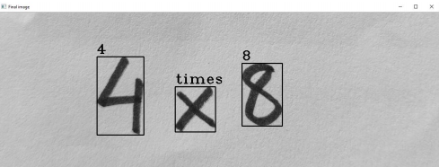
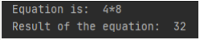
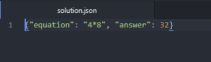

# **Equation solver**

The equation solver repository consists of all the required files for training and running the model to detect, recognize and solve common BODMAS equations.

The dataset used can be found here: 
https://www.kaggle.com/xainano/handwrittenmathsymbols

For a full implementation alongside outputs, check out my Kaggle notebook at the following URL: https://www.kaggle.com/namansood/equation-symbols

The files are the following:

* Training.ipynb - Run the notebook to train the model on the corresponding dataset. It incorporates regularization techniques for better accuracy.
* weights-improvement-10-0.97.hdf5 - Pre-trained files used for testing. The same can be used or can be retrained using the above notebook.
* Equation.py - Main program, has default images in case of no arguments. The image file path can be passed through the CLI interface. The outputs are printed in the CLI and also saved in a **solution.json** file.
* t(x).png/jpeg - Sample images that can be used for testing. 

Recognizing the image:

Print result:

Solution result

